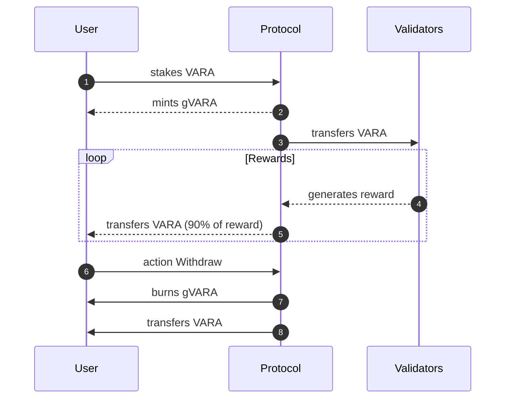

# Guardian Protocol

## Description

## Goals

- [ ] (smart-contract) implement `Action::Stake`
    The criteria points to select a validator will be:
        - Era points
        - Staked `$VARA` token
        - Rewards (ammount or percentage)
        - No experienced slashes
        - Commissions
    - [x] `get` the address of a validator
    - [x] `transfer` VARA from user to the validator
    - [x] `mint` gVARA for the user
    - [ ] add the transaction to the internal register
- [ ] (smart-contract) implement rewards functionality
    Currently, the GuardianProtocol will claim the rewards
    to the validators. The gVARA tokens will then allow the user to
    eventually withdrawn more VARA than the amount deposited.
    - [ ] `claim` the VARA rewards from the validator
    - [ ] `register` the rewards in the stake register of the user
- [ ] (smart-contract) implement `Action::Withdrawn`
    - [ ] 

