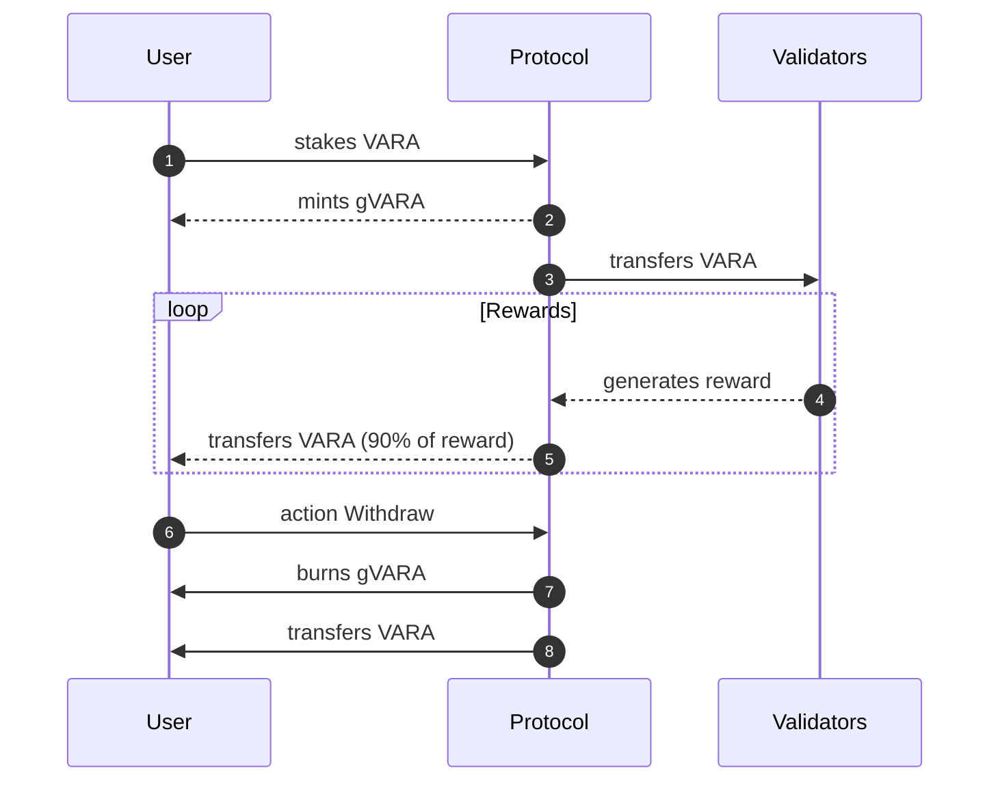

# Guardian Protocol

## Description

## Goals

- [ ] (smart-contract) implement `Action::Stake`
    - [x] `get` the address of a validator
    - [x] `transfer` VARA from user to the validator
    - [x] `mint` gVARA for the user
    - [ ] add the transaction to the internal register

    The criteria points to select a validator will be:
    - Era points
    - Staked `$VARA` token
    - Rewards (ammount or percentage)
    - No experienced slashes
    - Commissions

- [ ] (smart-contract) implement rewards functionality
    - [ ] `claim` the VARA rewards from the validator
    - [ ] `transfer` the VARA to the owner of the GuardianProtocol
    - [ ] `register` the rewards in the stake register of the user

    Currently, the GuardianProtocol will claim the rewards
    to the validators. The gVARA tokens will then allow the user to
    eventually withdrawn more VARA than the amount deposited.

- [ ] (smart-contract) implement `Action::Withdrawn`
    - [ ] given the register, check the rewards for the user
    - [ ] `burn` the amount of gVARA tokens
    - [ ] `transfer` the corresponding VARA to the user

